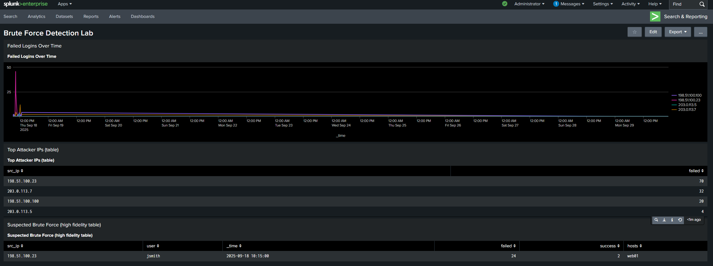
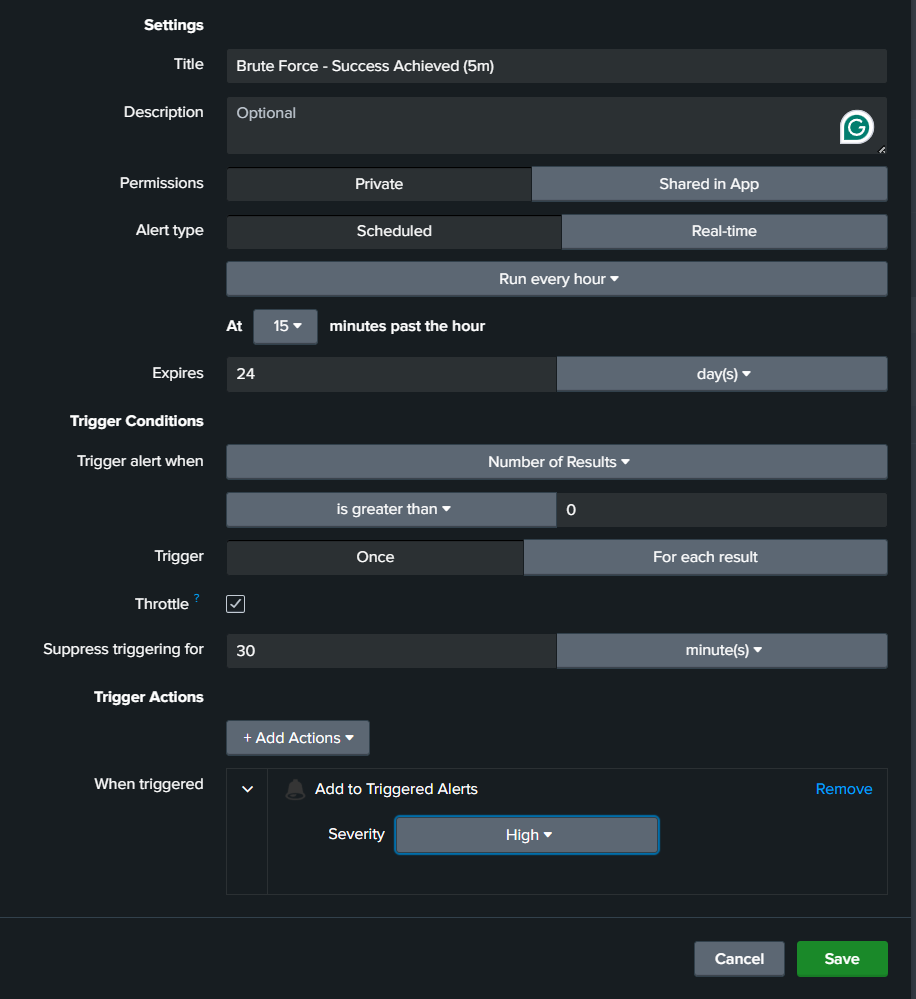
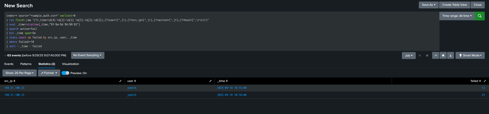
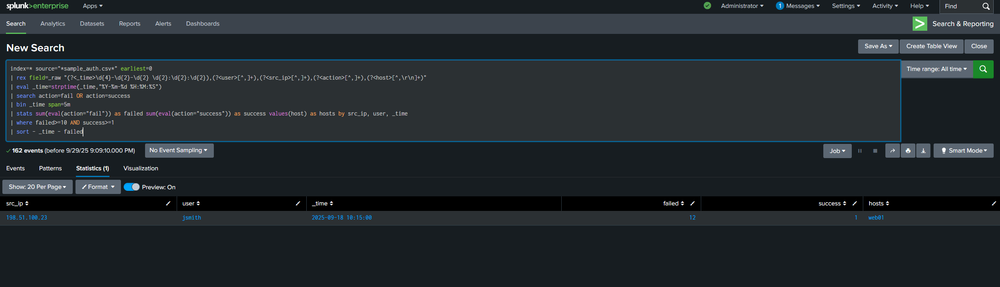

# Brute Force Detection (Splunk Lab)

This lab simulates brute-force login attempts and shows how to detect them in Splunk using SPL,
build a dashboard, and create an automated alert. It aligns with SOC Analyst responsibilities (alert triage, detection tuning) and maps to **MITRE ATT&CK T1110 (Brute Force)**.

## Data
- `data/sample_auth.csv` — synthetic auth events with benign logins and a brute-force burst from `198.51.100.23` against user `jsmith`.
- Columns: `_time, user, src_ip, action, host`
- Timestamp format: `Current Time`

## Ingest Steps (Splunk)
1. Create (or use) index: **security**
2. Add Data → Upload → select `sample_auth.csv`
3. Set **Sourcetype** to `auth:csv` (or create a new one), set **Timestamp** to `_time` with format `%Y-%m-%d %H:%M:%S`
4. Set **Host** field to `host` (field mapping) if prompted
5. Save and index into **security**

## Core Queries (SPL)
- **Basic threshold (fails in 5m):**
  ```spl
  index=security sourcetype=auth:csv action=fail
  | bin _time span=5m
  | stats count as failed by src_ip, user, _time
  | where failed >= 10
  | sort - _time, -failed
  ```

- **Fails followed by success (higher fidelity):**
  ```spl
  index=security sourcetype=auth:csv (action=fail OR action=success)
  | bin _time span=5m
  | stats sum(eval(action="fail")) as failed sum(eval(action="success")) as success values(host) as hosts by src_ip, user, _time
  | where failed>=10 AND success>=1
  | sort - _time, -failed
  ```

- **Top attackers:**
  ```spl
  index=security sourcetype=auth:csv action=fail
  | stats count as failed by src_ip
  | sort - failed
  ```

- **Failures over time (visual):**
  ```spl
  index=security sourcetype=auth:csv action=fail
  | timechart span=5m count as failed by src_ip limit=10 useother=f
  ```

## Dashboard
- Import `dashboard/brute_force_dashboard_simple.xml` (Classic Simple XML)
  - Splunk Web → Dashboards → Create new → Source → paste XML content → Save
  - Ensure queries point to `index=security` and `sourcetype=auth:csv`

## Alert
- See `alert/brute_force_alert.md` for configuration details.
- Recommended schedule: every hour; throttle 30 minutes.

## Documentation (for GitHub)

## Dashboard View


## Detection Alert


## SPL Queries



## Resume Bullet Tie-In
- Built Splunk correlation search & dashboard to detect brute-force attempts; tuned thresholds and created alerting playbook mapped to ATT&CK T1110.

---

